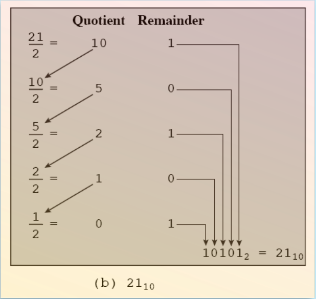
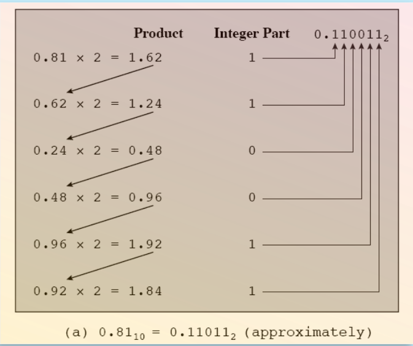
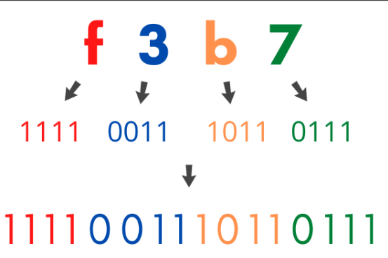
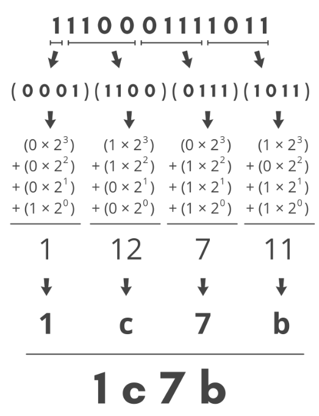
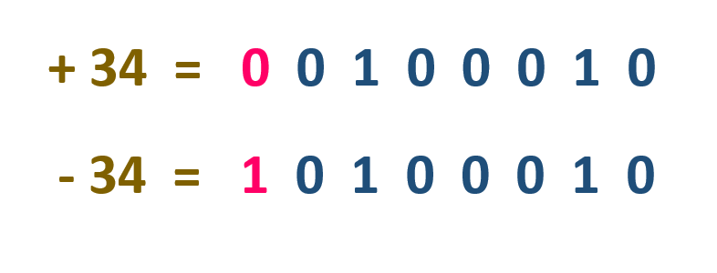
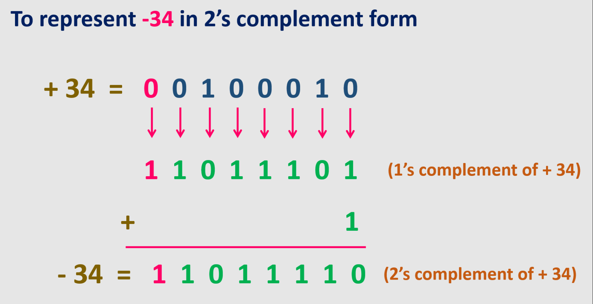

# Modeling of Minimum Systems and Computational Architectures

## Table of contents:

- [Von Neumann Model](#von)
- [Numerical Systems](#num)
- [Numerical System Convertion](#conv)
- [Binary System Notation (Negatives and floating point)](#dec)

<!--------------------------Von Neumann Model------------------------->

## Von Neumann Model

- `Memory:` stores the input, the results of the processing, and the program to be executed.
- `Control:` Reads the program and translates it into a series of operations that the processing unit performs.
- `Processing unit:` Carries out all the actual operations such as addition, multiplication, counting, comparison, etc., on the information it receives from memory.
- `Output:` Responds to the results from the processing unit, stored in memory, and transmitted to a specific device.

 

<!--------------------------Num sys------------------------->

## Numerical Systems

<blockquote>

<b>Decimal (Base 10)</b>

- Every day, we use a system based on decimal digits (0, 1, 2, 3, 4, 5, 6, 7, 8, 9) to represent numbers
- Numbers can be expressed as a sum of powers of 10 (Decimal):

  - $83_{ 10}=(8\times 10^1)+(3\times 10^2)$
  - $4708_{ 10} = (4\times 10^3)+(7\times 10^2)+(0\times 10^1)+(8\times 10^0)$
  - $96.47_{ 10} = (9\times 10^1)+(6\times 10^0)+(4\times 10^{-1})+(7\times 10^{-2})$

</blockquote>

<blockquote>

<b>Binary (Base 2)</b>

- Same as decimal system but the base changes to 2 and we only have 2 digits (0 and 1)
- Numbers can be expressed as a sum of powers of 2 (Binary):

  - $1001_{2} = (1\times 2^3)+(0\times 2^2)+(0\times 2^{1})+(1\times 2^{0})$
  - $1001.101_{2} = (1\times 2^3)+(0\times 2^2)+(0\times 2^{1})+(1\times 2^{0})+(1\times 2^{-1})+(0\times 2^{-2})+(1\times 2^{-1})$

</blockquote>

<blockquote>

<b>Hexadecimal (Base 16)</b>

- Base 16 with 16 digits (0,1,2,3,4,5,6,7,8,9,A,B,C,D,E,F)
- Numbers can be expressed as a sum of powers of 16 (Hexadecimal):

  - $1A_{16} = (1\times 16^1)+(A\times 16^0)$

</blockquote>

<!--------------------------Conversions ------------------------->

## Numerical System Convertion

<blockquote>

<b>Decimal $\rightarrow$ Binary</b>

Left to the point (`xxx`.xxx)
 

Right to the point (xxx.`xxx`) (Decide on a level of precision as it will go on forever)
 

</blockquote>

<blockquote>

<b>Binary $\rightarrow$ Decimal</b>

Add sum of powers
 

</blockquote>

<blockquote>

<b>Hexadecimal $\rightarrow$ Binary</b>

Split it into parts
 

</blockquote>

<blockquote>

<b>Binary $\rightarrow$ Hexadecimal</b>

Split it into parts
 

</blockquote>

## Binary System Notation (Negatives and floating point)

<blockquote>

<b>Sign-Magnitude (SM)</b> -Last bit to the left dictates if it's positive or negative

</blockquote>

 

<blockquote>

<b>2's complement (C2)</b> -Last bit to the left is 0, to convert number to negative invert all bits an add 1

With this format you can do addition as if they both were normal binary numbers, and get the result in C2 format

</blockquote>

 

<blockquote>

<b>32-Bit Binary Floating Point </b>

### Example: `101.101` to 32-bit floating point number

- Sign-bit stays as `0` as its a positive number

- Normalize the binary floating point number (make it format 1.xxxx)  
  $101.101_{2}\rightarrow1.01101\times2^2$ (exp 2 since the point was moved 2 times to the left )

- Add bias to exponent  $2_{10}+127_{10}=129\rightarrow$ `10000001` in binary  The bias depends on the size available for the exponent in this case its 8-Bits so its 127, the fomrula is:  Bias $= 2^{(k-1)} - 1$ where k is the number of bits in the exponent field.

- The mantissa is the number to the right of the point in the normalized number   $01101$ the rest of the bits will be $0$ that gives us `01101000000000000000000`

### Result:

`0 10000001 01101000000000000000000`

</blockquote>
